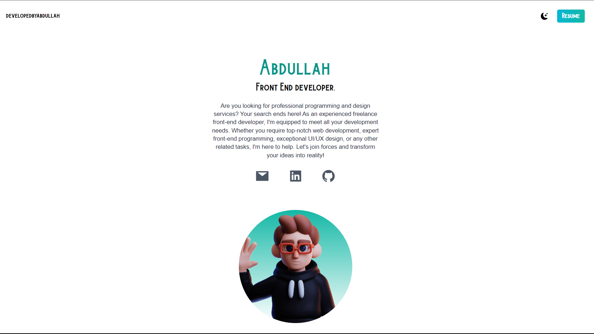

<!-- Project Screenshot -->

  

<!-- Project Title -->
<h1 align="center" style="font-size: 48px; margin-top: 20px; color: #333; text-shadow: 2px 2px 4px rgba(0, 0, 0, 0.2);">🚀 My Super Cool Website 🚀</h1>

<!-- Project Description -->

Explore a captivating website showcasing my HTML, CSS, JavaScript, Tailwind CSS, and React skills, infused with boundless creativity.

<!-- Key Features -->

  
  <strong>Clean Design</strong> |
  
  <strong>Responsive Layout</strong> |
  
  <strong>Smooth Animations</strong>

<!-- Technologies Used -->

  
  
  
  
  
  

<!-- Get Started Section -->
<h2 align="center" style="font-size: 36px; margin-top: 40px; color: #333;">Get Started</h2>

<!-- Installation -->
<h3 align="center" style="font-size: 28px; margin-top: 20px; color: #666;">Installation</h3>

Follow these steps to get the project up and running:

<ol align="center" style="font-size: 20px; margin-top: 20px; color: #666;">
  <li>Clone the repository to your local machine:</li>
</ol>

<pre align="center" style="font-size: 18px; margin-top: 10px; background-color: #f0f0f0; padding: 10px; border-radius: 5px; box-shadow: 0 2px 4px rgba(0, 0, 0, 0.1);">
  <code>git clone https://github.com/ABDULLAHRH1/React_Tailwind.git</code>
</pre>

<ol align="center" style="font-size: 20px; margin-top: 20px; color: #666;">
  <li>Open the project in your preferred code editor and start customizing!</li>
</ol>

Enjoy exploring and modifying this exciting project!

